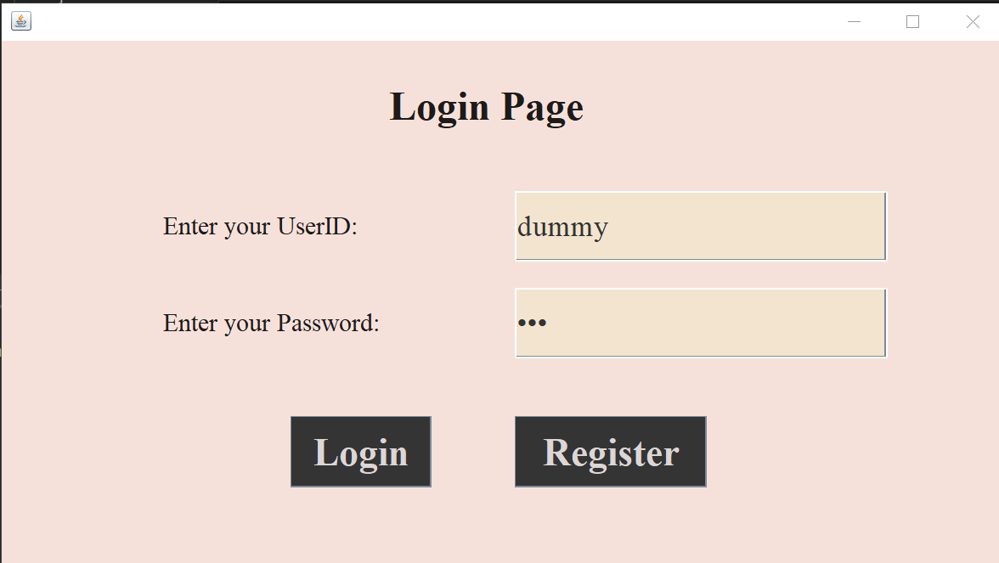
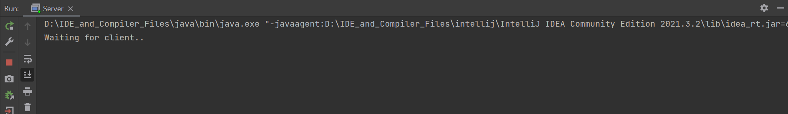
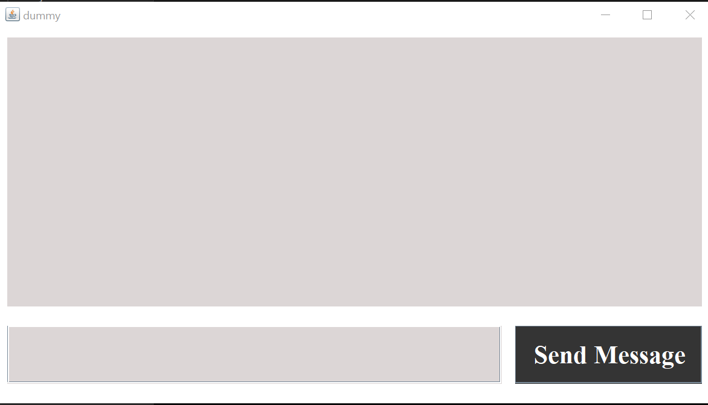
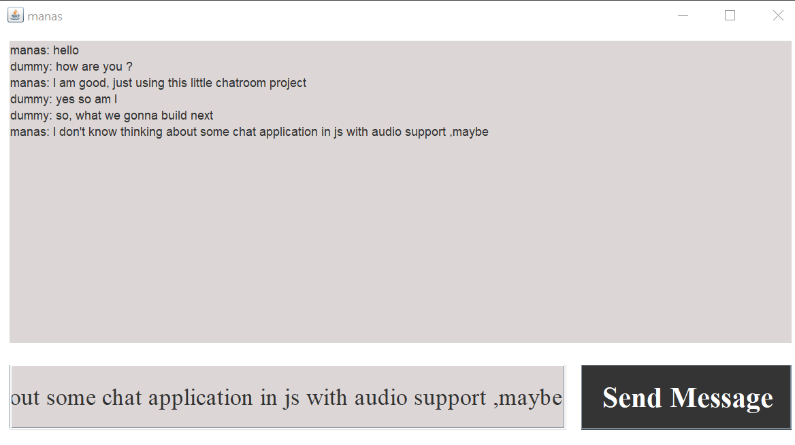

# Chat Room using JAVA

<br></br>
This project is an implementation of various networking and database concepts
like networking ,multithreading ,database connection and authentication. The project
provides user with ability to interact with other users over a local network.

# Installation
First clone the repo on the local machine.
```aidl
$ git clone --depth 1 https://github.com/manas221/huffman_textcompressor.git
```
**Ensure that JVM and JDK is pre-installed in the system.
Configure the username and password for the local mySQL before using the application**


# Usage
After cloning and installing th repo on local machine, move to src/ folder. Follow the next steps :

For Server:
```aidl
$ cd ChatRoomApp.git
$ cd src
$ javac com/ditu/chatapp/networking/Server.java
$ java com/ditu/chatapp/networking/Server
```

For Client:
```
$ cd ChatRoomApp.git
$ cd src
$ javac com/ditu/chatapp/views/UserView.java
$ java com/ditu/chatapp/networking/UserView
```

# Snapshots









# Concept Implemented
- Object Oriented Programming
- Networking
  - Socket Programming
  - Data transfer
- Server-Client Architecture
- Database Integration
  - Authentication
- Frontend Programming
